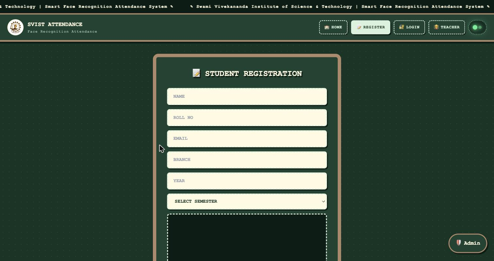
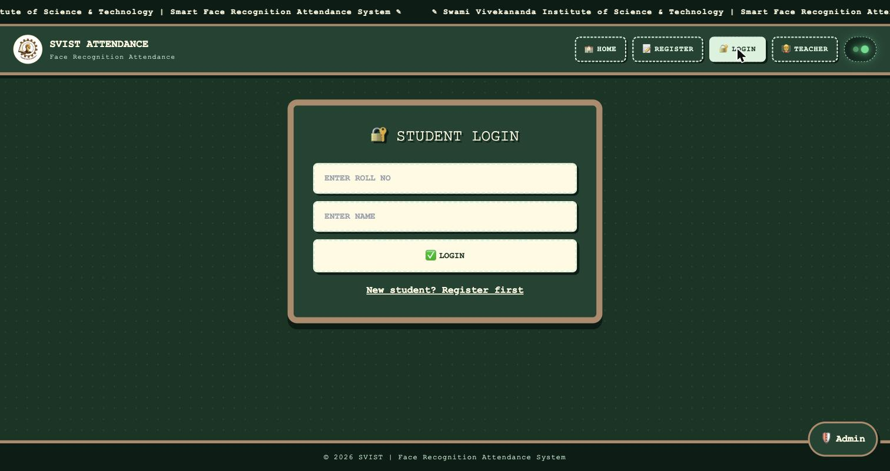
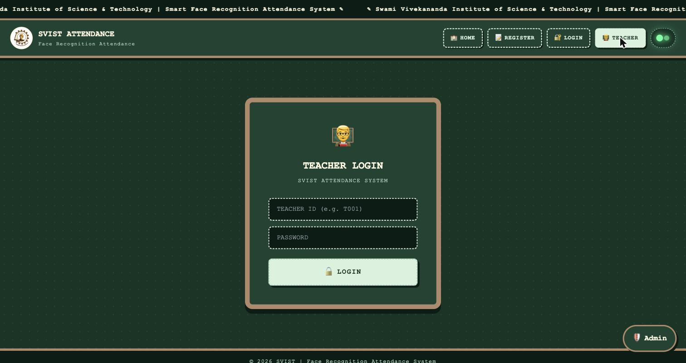
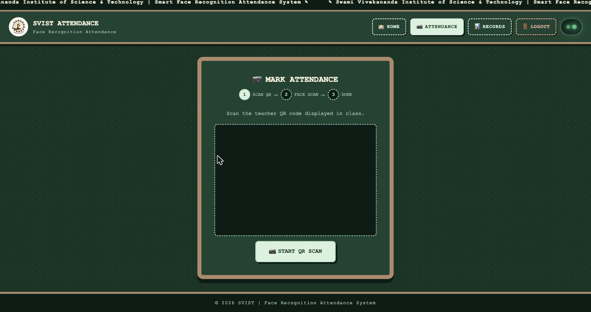
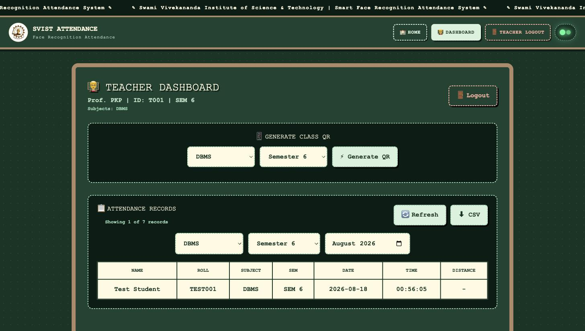
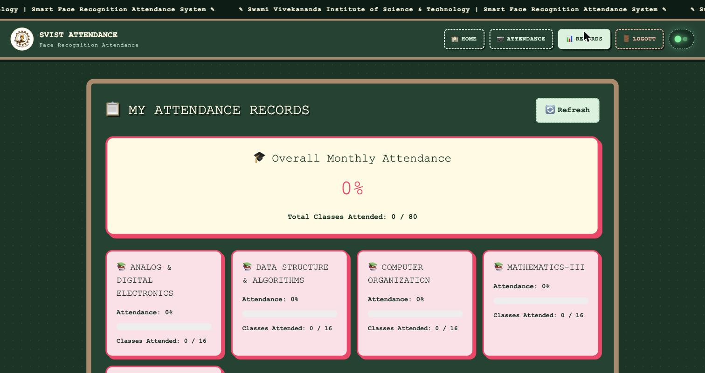
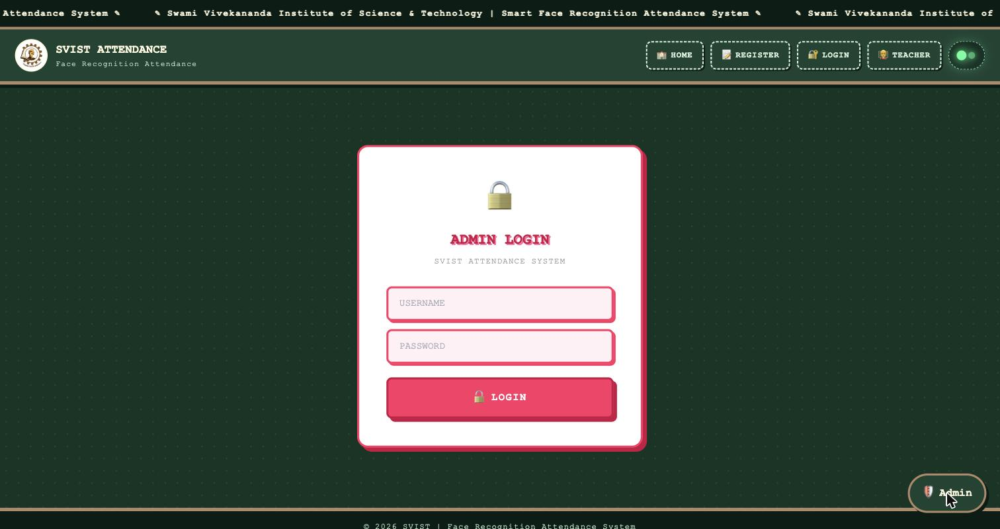
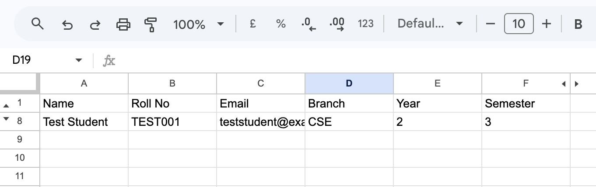
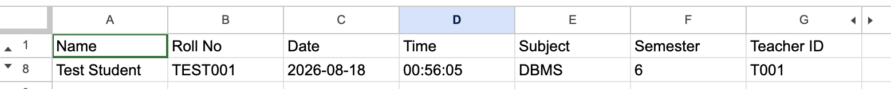

# SVIST Attendance System

A smart, face-recognition-based attendance system built for Swami Vivekananda Institute of Science & Technology. Students register their face once, and attendance is marked automatically by scanning a teacher's class QR code and a quick face scan — no manual roll calls, no proxy attendance.

**Live app:** [attendance-system-rouge-pi.vercel.app](https://attendance-system-rouge-pi.vercel.app)

---

## Features

- **Face-recognition registration** — students register once with a webcam photo; a face encoding is generated with `dlib` / `face_recognition` and stored securely.
- **QR + face two-factor attendance** — teachers generate a short-lived QR code per class; students scan it and confirm with a live face match before attendance is recorded.
- **Teacher dashboard** — generate class QR codes, view and filter attendance records by subject/semester/month, export to CSV.
- **Admin dashboard** — semester-wise attendance reports, Excel export, notice board management.
- **Student dashboard** — per-subject attendance percentage, monthly summary, full record history.
- **Notice board** — campus-wide announcements shown on the homepage.

## Screenshots

### Student Registration


### Student & Teacher Login
<p float="left">
  
  
</p>

### Mark Attendance (QR + Face Scan)


### Teacher Dashboard


### Student Attendance Records


### Admin Login


### Database (Google Sheets)
The app stores its data in a Google Sheet accessed through a service account — no traditional database server needed for application data.

<p float="left">
  
  
</p>

---

## Tech Stack

**Frontend**
- React 19 + Vite
- Tailwind CSS
- `@zxing/browser` for in-browser QR code scanning
- Axios

**Backend**
- Django 4 + Django REST Framework
- `face_recognition` / `dlib` for face encoding and matching
- OpenCV + Pillow for image processing
- `gspread` + a Google service account for reading/writing student, attendance, and notice data to Google Sheets
- SimpleJWT for admin auth

**Infrastructure**
- Frontend deployed on **Vercel**
- Backend deployed on **Render** (Docker), using a prebuilt `dlib-bin` wheel to avoid compiling `dlib` from source
- Database of record: **Google Sheets** (via service account) for application data; Postgres (**Neon**) for Django's own internal tables

---

## How Attendance Works

1. **Registration** — a student submits their details and a webcam photo. The backend detects the face, generates a 128-dimension encoding with `dlib`, and stores it alongside the student's record.
2. **QR generation** — a teacher picks a subject and semester and generates a QR code, valid for 15 minutes, containing a signed one-time token.
3. **Scan + match** — a student scans the QR, then takes a live photo. The backend re-encodes the new photo and compares it against all stored encodings using `face_recognition.compare_faces`. A match against the *logged-in* student's own face marks attendance; anything else is rejected.

---

## Local Development

### Backend
```bash
cd backend
python3 -m venv venv
source venv/bin/activate
pip install -r requirements.txt
cp .env.example .env   # fill in your own values
python manage.py migrate
python manage.py runserver
```

### Frontend
```bash
cd frontend
npm install
cp .env.example .env   # set VITE_API_URL to your backend URL
npm run dev
```

See `.env.example` in both `backend/` and `frontend/` for the required environment variables.

---

## License

This project was built for academic use at Swami Vivekananda Institute of Science & Technology.
